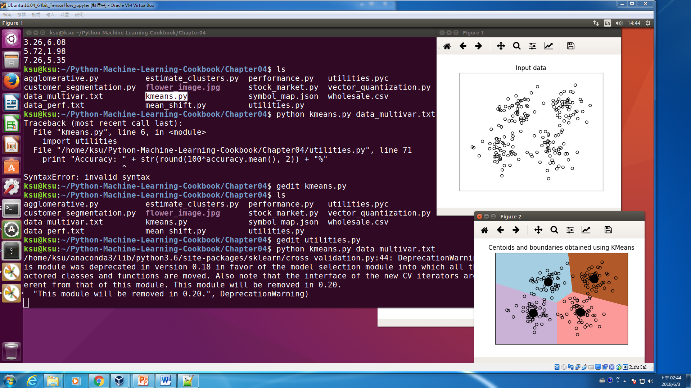
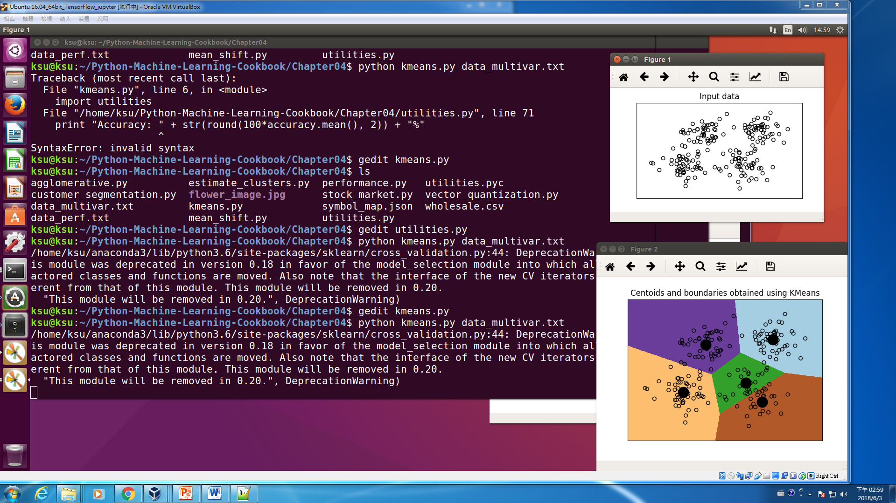

# 無監督學習 Unsupervised Learning


## 第4章 無監督學習——聚類CLUSTERING WITH UNSUPERVISED LEARNING
Clustering


### 4.2 用k-means演算法聚類資料Clustering data using the k-means algorithm ==>kmeans.py

>* 課本是for python 2
>* 我們的教學環境是python 3 ==> 注意錯誤代碼的訊息,在修改相關程式(通常是print)
>* https://github.com/scikit-learn/scikit-learn/blob/master/sklearn/cluster/k_means_.py
```
import numpy as np
import matplotlib.pyplot as plt
from sklearn import metrics
from sklearn.cluster import KMeans

import utilities

# Load data
data = utilities.load_data('data_multivar.txt')
num_clusters = 4

# Plot data
plt.figure()
plt.scatter(data[:,0], data[:,1], marker='o', 
        facecolors='none', edgecolors='k', s=30)
x_min, x_max = min(data[:, 0]) - 1, max(data[:, 0]) + 1
y_min, y_max = min(data[:, 1]) - 1, max(data[:, 1]) + 1
plt.title('Input data')
plt.xlim(x_min, x_max)
plt.ylim(y_min, y_max)
plt.xticks(())
plt.yticks(())

# Train the model
kmeans = KMeans(init='k-means++', n_clusters=num_clusters, n_init=10)
kmeans.fit(data)

# Step size of the mesh
step_size = 0.01

# Plot the boundaries
x_min, x_max = min(data[:, 0]) - 1, max(data[:, 0]) + 1
y_min, y_max = min(data[:, 1]) - 1, max(data[:, 1]) + 1
x_values, y_values = np.meshgrid(np.arange(x_min, x_max, step_size), np.arange(y_min, y_max, step_size))

# Predict labels for all points in the mesh
predicted_labels = kmeans.predict(np.c_[x_values.ravel(), y_values.ravel()])

# Plot the results
predicted_labels = predicted_labels.reshape(x_values.shape)
plt.figure()
plt.clf()
plt.imshow(predicted_labels, interpolation='nearest',
           extent=(x_values.min(), x_values.max(), y_values.min(), y_values.max()),
           cmap=plt.cm.Paired,
           aspect='auto', origin='lower')

plt.scatter(data[:,0], data[:,1], marker='o', 
        facecolors='none', edgecolors='k', s=30)

centroids = kmeans.cluster_centers_
plt.scatter(centroids[:,0], centroids[:,1], marker='o', s=200, linewidths=3,
        color='k', zorder=10, facecolors='black')
x_min, x_max = min(data[:, 0]) - 1, max(data[:, 0]) + 1
y_min, y_max = min(data[:, 1]) - 1, max(data[:, 1]) + 1
plt.title('Centoids and boundaries obtained using KMeans')
plt.xlim(x_min, x_max)
plt.ylim(y_min, y_max)
plt.xticks(())
plt.yticks(())
plt.show()
```




### 4.3 用向量量化壓縮圖片Compressing an image using vector quantization ==> vector_quantization.py

vector quantization is the N-dimensional version of "rounding off".

http://www.datacompression.com/vq.shtml

Vector quantization is popularly used in image compression
where we store each pixel using fewer bits than the original image to achieve compression

```
import argparse

import numpy as np
from scipy import misc 
from sklearn import cluster
import matplotlib.pyplot as plt

def build_arg_parser():
    parser = argparse.ArgumentParser(description='Compress the input image \
            using clustering')
    parser.add_argument("--input-file", dest="input_file", required=True,
            help="Input image")
    parser.add_argument("--num-bits", dest="num_bits", required=False,
            type=int, help="Number of bits used to represent each pixel")
    return parser

def compress_image(img, num_clusters):
    # Convert input image into (num_samples, num_features) 
    # array to run kmeans clustering algorithm 
    X = img.reshape((-1, 1))  

    # Run kmeans on input data
    kmeans = cluster.KMeans(n_clusters=num_clusters, n_init=4, random_state=5)
    kmeans.fit(X)
    centroids = kmeans.cluster_centers_.squeeze()
    labels = kmeans.labels_

    # Assign each value to the nearest centroid and 
    # reshape it to the original image shape
    input_image_compressed = np.choose(labels, centroids).reshape(img.shape)

    return input_image_compressed

def plot_image(img, title):
    vmin = img.min()
    vmax = img.max()
    plt.figure()
    plt.title(title)
    plt.imshow(img, cmap=plt.cm.gray, vmin=vmin, vmax=vmax)

if __name__=='__main__':
    args = build_arg_parser().parse_args()
    input_file = args.input_file
    num_bits = args.num_bits

    if not 1 <= num_bits <= 8:
        raise TypeError('Number of bits should be between 1 and 8')

    num_clusters = np.power(2, num_bits)

    # Print compression rate
    compression_rate = round(100 * (8.0 - args.num_bits) / 8.0, 2)
    print "\nThe size of the image will be reduced by a factor of", 8.0/args.num_bits
    print "\nCompression rate = " + str(compression_rate) + "%"

    # Load input image
    input_image = misc.imread(input_file, True).astype(np.uint8)

    # original image 
    plot_image(input_image, 'Original image')

    # compressed image 
    input_image_compressed = compress_image(input_image, num_clusters)
    plot_image(input_image_compressed, 'Compressed image; compression rate = ' 
            + str(compression_rate) + '%')

    plt.show()

```

python vector_quantization.py --input-file flower_image.jpg --num-bits 4

python vector_quantization.py --input-file flower_image.jpg --num-bits 2

python vector_quantization.py --input-file flower_image.jpg --num-bits 1

### 4.4 建立均值漂移聚類模型Building a Mean Shift clustering model ==> mean_shift.py

>* http://homepages.inf.ed.ac.uk/rbf/CVonline/LOCAL_COPIES/TUZEL1/MeanShift.pdf

```
import numpy as np
from sklearn.cluster import MeanShift, estimate_bandwidth

import utilities

# Load data from input file
X = utilities.load_data('data_multivar.txt')

# Estimating the bandwidth 
bandwidth = estimate_bandwidth(X, quantile=0.1, n_samples=len(X))

# Compute clustering with MeanShift
meanshift_estimator = MeanShift(bandwidth=bandwidth, bin_seeding=True)
meanshift_estimator.fit(X)
labels = meanshift_estimator.labels_
centroids = meanshift_estimator.cluster_centers_
num_clusters = len(np.unique(labels))

print "Number of clusters in input data =", num_clusters

###########################################################
# Plot the points and centroids 

import matplotlib.pyplot as plt
from itertools import cycle

plt.figure()

# specify marker shapes for different clusters
markers = '.*xv'

for i, marker in zip(range(num_clusters), markers):
    # plot the points belong to the current cluster
    plt.scatter(X[labels==i, 0], X[labels==i, 1], marker=marker, color='k')

    # plot the centroid of the current cluster
    centroid = centroids[i]
    plt.plot(centroid[0], centroid[1], marker='o', markerfacecolor='k',
             markeredgecolor='k', markersize=15)

plt.title('Clusters and their centroids')
plt.show()

```

### 4.5 用凝聚層次聚類進行資料分組Grouping data using agglomerative clustering ==> agglomerative.py

```
import numpy as np
import matplotlib.pyplot as plt
from sklearn.cluster import AgglomerativeClustering
from sklearn.neighbors import kneighbors_graph

def add_noise(x, y, amplitude):
    X = np.concatenate((x, y))
    X += amplitude * np.random.randn(2, X.shape[1])
    return X.T

def get_spiral(t, noise_amplitude=0.5):
    r = t
    x = r * np.cos(t)
    y = r * np.sin(t)

    return add_noise(x, y, noise_amplitude)

def get_rose(t, noise_amplitude=0.02):
    # Equation for "rose" (or rhodonea curve); if k is odd, then
    # the curve will have k petals, else it will have 2k petals
    k = 5       
    r = np.cos(k*t) + 0.25 
    x = r * np.cos(t)
    y = r * np.sin(t)

    return add_noise(x, y, noise_amplitude)

def get_hypotrochoid(t, noise_amplitude=0):
    a, b, h = 10.0, 2.0, 4.0
    x = (a - b) * np.cos(t) + h * np.cos((a - b) / b * t) 
    y = (a - b) * np.sin(t) - h * np.sin((a - b) / b * t) 

    return add_noise(x, y, 0)

def perform_clustering(X, connectivity, title, num_clusters=3, linkage='ward'):
    plt.figure()
    model = AgglomerativeClustering(linkage=linkage, 
                    connectivity=connectivity, n_clusters=num_clusters)
    model.fit(X)

    # extract labels
    labels = model.labels_

    # specify marker shapes for different clusters
    markers = '.vx'

    for i, marker in zip(range(num_clusters), markers):
        # plot the points belong to the current cluster
        plt.scatter(X[labels==i, 0], X[labels==i, 1], s=50, 
                    marker=marker, color='k', facecolors='none')

    plt.title(title)

if __name__=='__main__':
    # Generate sample data
    n_samples = 500 
    np.random.seed(2)
    t = 2.5 * np.pi * (1 + 2 * np.random.rand(1, n_samples))
    X = get_spiral(t)

    # No connectivity
    connectivity = None 
    perform_clustering(X, connectivity, 'No connectivity')

    # Create K-Neighbors graph 
    connectivity = kneighbors_graph(X, 10, include_self=False)
    perform_clustering(X, connectivity, 'K-Neighbors connectivity')

    plt.show()

```


### 4.6 評價聚類演算法的聚類效果Evaluating the performance of clustering algorithms  ==> performance.py

```
import numpy as np
import matplotlib.pyplot as plt
from sklearn import metrics
from sklearn.cluster import KMeans

import utilities

# Load data
data = utilities.load_data('data_perf.txt')

scores = []
range_values = np.arange(2, 10)

for i in range_values:
    # Train the model
    kmeans = KMeans(init='k-means++', n_clusters=i, n_init=10)
    kmeans.fit(data)
    score = metrics.silhouette_score(data, kmeans.labels_, 
                metric='euclidean', sample_size=len(data))

    print "\nNumber of clusters =", i
    print "Silhouette score =", score
                    
    scores.append(score)

# Plot scores
plt.figure()
plt.bar(range_values, scores, width=0.6, color='k', align='center')
plt.title('Silhouette score vs number of clusters')

# Plot data
plt.figure()
plt.scatter(data[:,0], data[:,1], color='k', s=30, marker='o', facecolors='none')
x_min, x_max = min(data[:, 0]) - 1, max(data[:, 0]) + 1
y_min, y_max = min(data[:, 1]) - 1, max(data[:, 1]) + 1
plt.title('Input data')
plt.xlim(x_min, x_max)
plt.ylim(y_min, y_max)
plt.xticks(())
plt.yticks(())

plt.show()

```

### 4.7 用DBSCAN演算法自動估算集群數量Automatically estimating the number of clusters using DBSCAN algorithm   ==> estimate_clusters.py

```
import numpy as np
import matplotlib.pyplot as plt
from sklearn import metrics
from sklearn.cluster import KMeans

import utilities

# Load data
data = utilities.load_data('data_perf.txt')

scores = []
range_values = np.arange(2, 10)

for i in range_values:
    # Train the model
    kmeans = KMeans(init='k-means++', n_clusters=i, n_init=10)
    kmeans.fit(data)
    score = metrics.silhouette_score(data, kmeans.labels_, 
                metric='euclidean', sample_size=len(data))

    print "\nNumber of clusters =", i
    print "Silhouette score =", score
                    
    scores.append(score)

# Plot scores
plt.figure()
plt.bar(range_values, scores, width=0.6, color='k', align='center')
plt.title('Silhouette score vs number of clusters')

# Plot data
plt.figure()
plt.scatter(data[:,0], data[:,1], color='k', s=30, marker='o', facecolors='none')
x_min, x_max = min(data[:, 0]) - 1, max(data[:, 0]) + 1
y_min, y_max = min(data[:, 1]) - 1, max(data[:, 1]) + 1
plt.title('Input data')
plt.xlim(x_min, x_max)
plt.ylim(y_min, y_max)
plt.xticks(())
plt.yticks(())

plt.show()

```

### 4.8 探索股票資料的模式Finding patterns in stock market data ==> stock_market.py

```
import json
import datetime

import numpy as np
import matplotlib.pyplot as plt
from sklearn import covariance, cluster
from matplotlib.finance import quotes_historical_yahoo_ochl as quotes_yahoo

# Input symbol file
symbol_file = 'symbol_map.json'

# Choose a time period
start_date = datetime.datetime(2004, 4, 5)
end_date = datetime.datetime(2007, 6, 2)

# Load the symbol map
with open(symbol_file, 'r') as f:
    symbol_dict = json.loads(f.read())

symbols, names = np.array(list(symbol_dict.items())).T

quotes = [quotes_yahoo(symbol, start_date, end_date, asobject=True) 
                for symbol in symbols]

# Extract opening and closing quotes
opening_quotes = np.array([quote.open for quote in quotes]).astype(np.float)
closing_quotes = np.array([quote.close for quote in quotes]).astype(np.float)

# The daily fluctuations of the quotes 
delta_quotes = closing_quotes - opening_quotes

# Build a graph model from the correlations
edge_model = covariance.GraphLassoCV()

# Standardize the data 
X = delta_quotes.copy().T
X /= X.std(axis=0)

# Train the model
with np.errstate(invalid='ignore'):
    edge_model.fit(X)

# Build clustering model using affinity propagation
_, labels = cluster.affinity_propagation(edge_model.covariance_)
num_labels = labels.max()

# Print the results of clustering
for i in range(num_labels + 1):
    print "Cluster", i+1, "-->", ', '.join(names[labels == i])


```

### 4.9 建立客戶細分模型Building a customer segmentation model ==> customer_segmentation.py

```
import csv

import numpy as np
from sklearn import cluster, covariance, manifold
from sklearn.cluster import MeanShift, estimate_bandwidth
import matplotlib.pyplot as plt

# Load data from input file
input_file = 'wholesale.csv'
file_reader = csv.reader(open(input_file, 'rb'), delimiter=',')
X = []
for count, row in enumerate(file_reader):
    if not count:
        names = row[2:]
        continue

    X.append([float(x) for x in row[2:]])

# Input data as numpy array
X = np.array(X)

# Estimating the bandwidth 
bandwidth = estimate_bandwidth(X, quantile=0.8, n_samples=len(X))

# Compute clustering with MeanShift
meanshift_estimator = MeanShift(bandwidth=bandwidth, bin_seeding=True)
meanshift_estimator.fit(X)
labels = meanshift_estimator.labels_
centroids = meanshift_estimator.cluster_centers_
num_clusters = len(np.unique(labels))

print "\nNumber of clusters in input data =", num_clusters

print "\nCentroids of clusters:"
print '\t'.join([name[:3] for name in names])
for centroid in centroids:
    print '\t'.join([str(int(x)) for x in centroid])

################
# Visualizing data

centroids_milk_groceries = centroids[:, 1:3]

# Plot the nodes using the coordinates of our centroids_milk_groceries
plt.figure()
plt.scatter(centroids_milk_groceries[:,0], centroids_milk_groceries[:,1], 
        s=100, edgecolors='k', facecolors='none')

offset = 0.2
plt.xlim(centroids_milk_groceries[:,0].min() - offset * centroids_milk_groceries[:,0].ptp(),
        centroids_milk_groceries[:,0].max() + offset * centroids_milk_groceries[:,0].ptp(),)
plt.ylim(centroids_milk_groceries[:,1].min() - offset * centroids_milk_groceries[:,1].ptp(),
        centroids_milk_groceries[:,1].max() + offset * centroids_milk_groceries[:,1].ptp())

plt.title('Centroids of clusters for milk and groceries')
plt.show()

```


